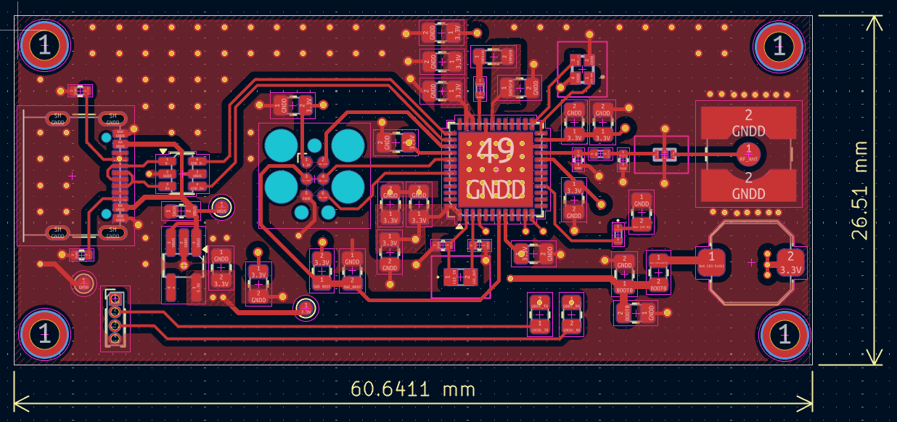
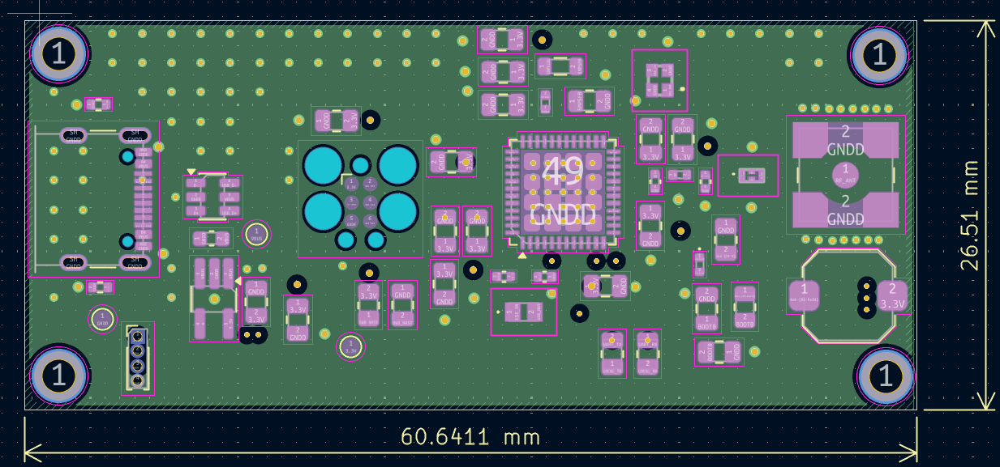
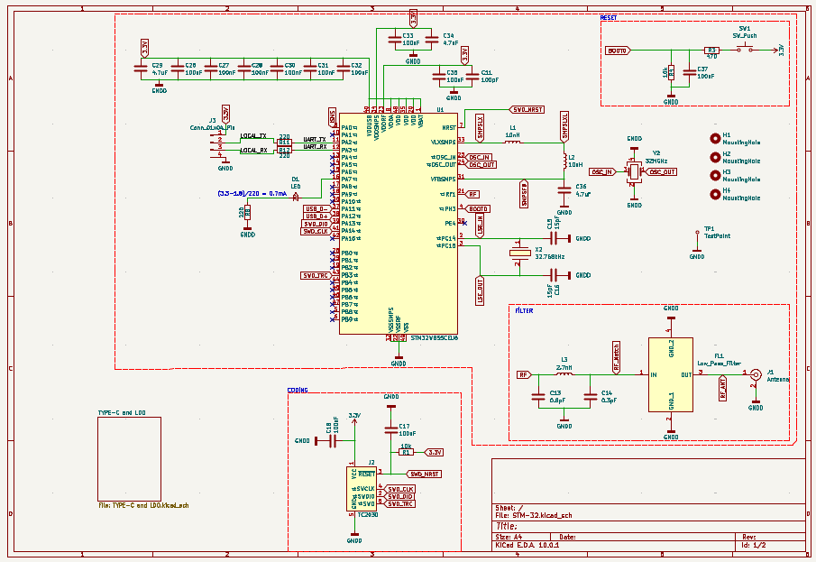
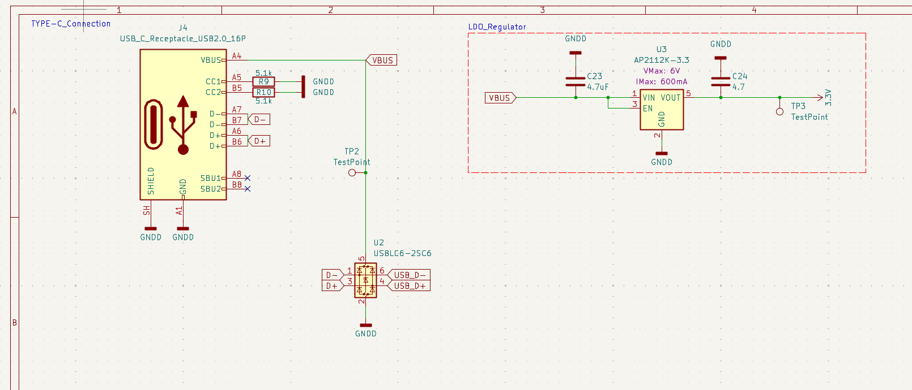
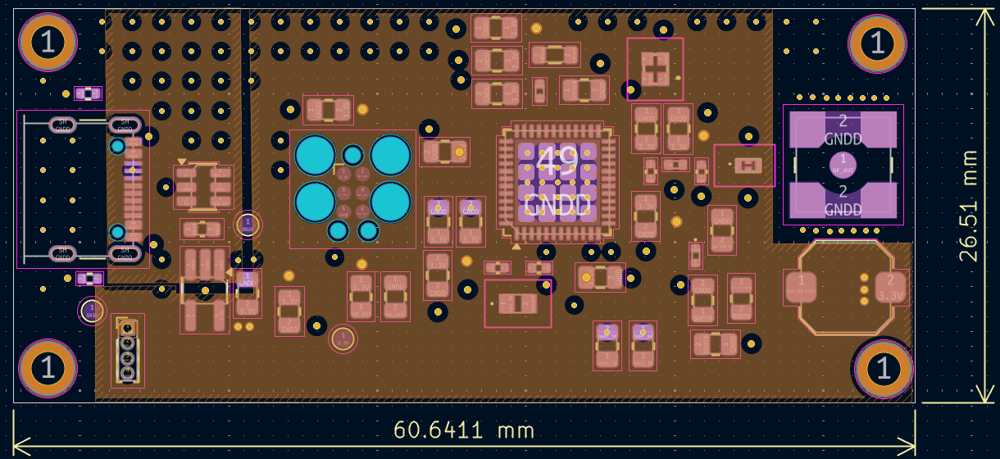
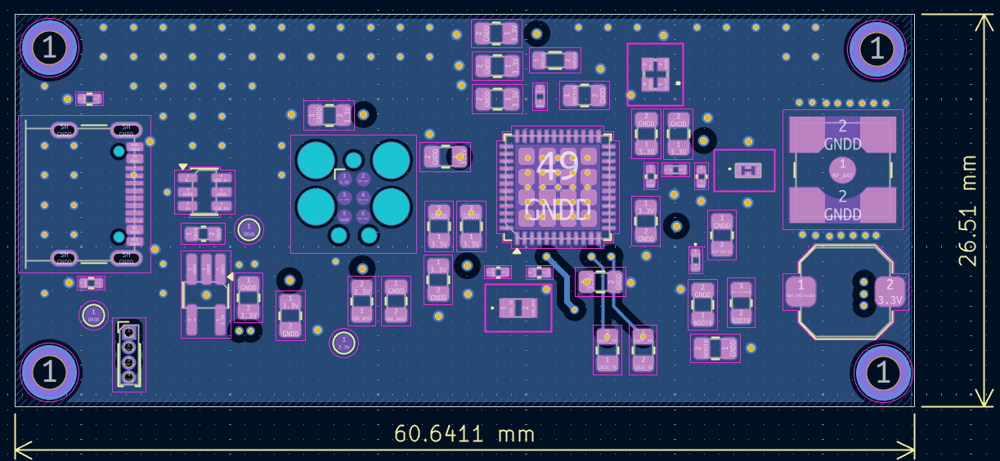

# STM32 4-Layer Wireless Core Board

A compact, 4-layer reusable STM32 wireless core board designed in KiCad. It functions both as a standalone USB-to-Wireless dongle/sniffer and as a modular core block for integration into larger IoT and embedded carrier boards.

---

## 📌 Board Overview

| 3D / Top Layer View | Inner Ground Plane |
| :---: | :---: |
|  |  |

---

## 🚀 Key Features

* **MCU & Core:** STM32 microcontroller with integrated RF capabilities.
* **4-Layer Optimized Stackup:**
  * **Layer 1 (Top):** High-speed signals, RF trace, and localized GND polygon.
  * **Layer 2 (Inner 1):** Solid, unbroken Ground Reference Plane for signal integrity and RF return paths.
  * **Layer 3 (Inner 2):** Dedicated power plane split (3.3V and VBUS) optimized with Non-Functional Pad (NFP) removal to maximize copper pouring.
  * **Layer 4 (Bottom):** Auxiliary low-speed signal routing (UART TX/RX) and continuous GND shielding.
* **RF Architecture:**
  * 50 Ω impedance-matched microstrip line leading to antenna pad.
  * Perimeter and coplanar ground via stitching for minimal EMI and optimal shield performance.
* **Power Management:**
  * USB Type-C input with CC1/CC2 pull-down configuration.
  * Electrostatic Discharge (ESD) protection IC (`USBLC6-2SC6`) on differential USB data lines.
  * Low-noise, low-dropout linear regulator (`AP2112K-3.3V`, up to 600 mA).
* **Interfaces & Debugging:**
  * Dedicated Serial Wire Debug (SWD) test pad group for programming and hardware breakpoints.
  * Hardware `NRST` and `BOOT0` selection pads.
  * UART interface (`LOCAL_TX` / `LOCAL_RX`) with 220 Ω series current-limiting resistors for real-time logging.

---

## 📐 Schematic Sheets

| Sheet 1: MCU & RF Core | Sheet 2: Type-C & LDO Power |
| :---: | :---: |
|  |  |

---

## 🗂️ Layer Stackup Details

| Layer 1: Top Signal / GND | Layer 2: Inner Full GND |
| :---: | :---: |
|  |  |

| Layer 3: Inner Power (VBUS & 3.3V) | Layer 4: Bottom Signal / GND |
| :---: | :---: |
|  |  |

---

## 📦 Manufacturing & Assembly Files

All fabrication and assembly files are pre-generated and ready for fabrication (JLCPCB, PCBWay, etc.):

* **Gerber & Drill Package:** [`STM-32_Gerber.zip`](STM-32_Gerber.zip)
* **Bill of Materials (BOM):** [`bom.csv`](bom.csv)
* **Component Placement (CPL / Centroid):** [`positions.csv`](positions.csv)
* **Designators:** [`designators.csv`](designators.csv)
* **Netlist IPC:** [`netlist.ipc`](netlist.ipc)

---

## 💻 Hardware Design Files

To open and modify the native project, open `STM-32.kicad_pro` using KiCad.

* `STM-32.kicad_pro`: KiCad project settings file
* `STM-32.kicad_sch`: Root schematic sheet
* `TYPE-C and LDO.kicad_sch`: Sub-sheet for power distribution
* `STM-32.kicad_pcb`: 4-layer PCB layout
